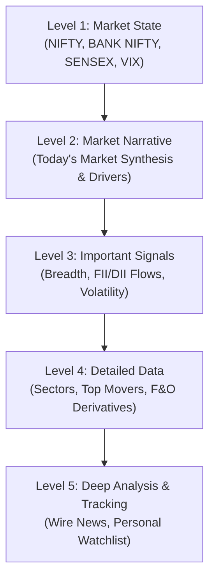

# MarketPulse — Master Implementation Plan & Architectural Blueprint

> **Product Vision**: "Open the site and understand the Indian market in 60 seconds."  
> An authentic, institutional-grade financial intelligence command center providing:  
> **Signal → Context → AI Explanation → What to Watch.**  
> **Status**: **Phase 1 & Phase 2 Complete** (Core Terminal Refactored, All 11 Routes Live, Zero Build Errors).

---

## 1. Executive Summary & Transformation Goals

MarketPulse was refactored from a dense, boxed cyber-trading layout into an authentic, institutional financial product. The objective was to prioritize **information hierarchy over information density**, allowing a user to comprehend Indian market dynamics within 30 to 60 seconds.



---

## 2. Locked Visual Design System

### A. Color Tokens
| Variable | Hex / Value | Applied Usage |
|---|---|---|
| `--bg` | `#0B0D11` | Near-black / deep charcoal canvas |
| `--panel` | `#11141A` | Navigation sidebar & container background |
| `--panel-card` | `#151821` | Financial cards (`.fin-card`) |
| `--border` | `rgba(255, 255, 255, 0.08)` | 1px hairline card borders |
| `--border-subtle` | `rgba(255, 255, 255, 0.05)` | Section hairline dividers |
| `--text` | `#F3F4F6` | Primary high-contrast typography |
| `--text-secondary`| `#9CA3AF` | Section headers and secondary body text |
| `--muted` | `#6B7280` | Micro-labels, column captions, timestamps |
| `--pos` | `#10B981` | Muted financial emerald (price gains, advances) |
| `--neg` | `#F43F5E` | Muted financial crimson (price drops, declines) |
| `--accent` | `#D9A441` | Restrained warm amber/gold (active nav, key levels) |

### B. Typography Hierarchy
- **Page Titles**: 24–28px, semi-bold sans-serif (`IBM Plex Sans`).
- **Section Titles**: 13–15px, uppercase, tracking-wider with subtle hairlines (`border-b border-white/[0.06]`).
- **Primary Figures**: 24–28px font-bold `font-mono tabular-nums` (`IBM Plex Mono`).
- **Standard Body / Reading Content**: 13–14px font-normal with 1.5–1.6 line height.
- **Secondary Metadata**: 11–12px monospace for timestamps, basis points, and volume multipliers.

---

## 3. Application Shell & Navigation Layout

```
┌────────────────────────────────────────────────────────────────────────────────────────┐
│ TOPBAR (h-14): Logo | Search (⌘K) | Market Status Dot | 15:30 IST | DEMO DATA | Profile│
├───────────────┬────────────────────────────────────────────────────────────────────────┤
│ SIDEBAR (224px)│ MAIN CONTENT WORKSPACE (max-w-[1440px] centered)                      │
│ • Overview    │                                                                        │
│ • Markets     │ 1. Market Overview (NIFTY, BANK NIFTY, SENSEX, INDIA VIX)              │
│ • Stocks      │ 2. Global Markets Strip (S&P 500, NASDAQ, DOW, DXY, CRUDE, GOLD, FX)   │
│ • F&O         │ 3. Market Narrative (Today's Market, Key Drivers, What to Watch)       │
│ • Screener    │ 4. Market Snapshot (Breadth with 52W Hi/Lo, FII/DII Flows, Volatility) │
│ • News        │ 5. Sector Performance (Responsive Grid with 1D/1W/1M filter)           │
│ • Analysis    │ 6. Top Movers (Spacious Table: Gainers, Losers, Volume, Unusual)       │
│ • Watchlist   │ 7. F&O Snapshot (PCR, Max Pain, ATM IV + Call vs Put OI Visual Bar)    │
│ • Alerts      │ 8. Market News & Dispatches (Categorized wire feed + Ticker tags)      │
│ • Calendar    │ 9. Personal Watchlist (Prominent, sparklines, + Add stock)             │
│ • Settings    │                                                                        │
└───────────────┴────────────────────────────────────────────────────────────────────────┘
```

---

## 4. Phase-by-Phase Implementation Roadmap

### Phase 1: Foundation & Design System (Completed)
- [x] Initialized Next.js App Router with TypeScript & Tailwind CSS.
- [x] Configured Google Fonts (`IBM Plex Sans` and `IBM Plex Mono`).
- [x] Created `fin-card`, `fin-table`, and `financial-divider` styling primitives in `globals.css`.
- [x] Built the expanded 224px `Sidebar` with icons + text labels and collapse toggle.
- [x] Built clean 56px `Topbar` with global ⌘K Command Palette, real-time IST clock, and market status dot.

### Phase 2: 9-Section Dashboard Redesign (Completed)
- [x] **Section 1 (Market Overview)**: Horizontal minimal index cards with 26px primary number focus and directional SVG sparklines.
- [x] **Section 2 (Market Narrative)**: "TODAY'S MARKET" narrative area with Key Drivers and What to Watch (no fake AI confidence numbers).
- [x] **Section 3 (Market Snapshot)**: 3-column layout for Market Breadth (with 52W Hi/Lo), Institutional Flows (FII/DII with 5-day trend), and Volatility (India VIX & regime).
- [x] **Section 4 (Sector Performance)**: Responsive grid with 1D, 1W, and 1M filters and subtle backgrounds.
- [x] **Section 5 (Top Movers)**: Spacious financial table with Gainers, Losers, Volume, and Unusual Activity tabs.
- [x] **Section 6 (Global Markets)**: Compact horizontal supporting strip (S&P 500, NASDAQ, DOW, DXY, CRUDE, GOLD, USD/INR).
- [x] **Section 7 (F&O Snapshot)**: Dedicated section with PCR, Max Pain, ATM IV, Futures basis, and Call OI vs Put OI visual comparison bar.
- [x] **Section 8 (News)**: Clean financial newsfeed with source, time, impact badge, and related tickers.
- [x] **Section 9 (Personal Watchlist)**: Prominent list (`RELIANCE`, `HDFCBANK`, `TCS`, `INFY`, `TATAMOTORS`) with live sparklines and inline `+ Add stock` modal.

### Phase 3: Dedicated Workspaces & Detail Views (Completed)
- [x] **`/stocks/[symbol]`**: Strict 8-level financial hierarchy:
  1. Stock Header (`RELIANCE ₹3,012.45 +1.15%`)
  2. Price Chart (Area / Candlestick with range controls)
  3. Key Metrics (Market Cap, P/E, EPS, 52W High, 52W Low, Volume)
  4. Today's Movement (Open, Previous Close, High, Low)
  5. Technical Snapshot (RSI 14, 20/50/200 DMAs, MACD, Beta)
  6. Company Dispatches & News
  7. Equity Synthesis & Regime (Catalyst, Risk Factors, Key Levels)
  8. Upcoming Events & Corporate Actions
- [x] **`/fno`**: Dedicated derivatives workspace with NIFTY / BANK NIFTY toggle, Spot/Futures/PCR/IV/Max Pain stats, full readable option chain with highlighted ATM strike, and participant build-up categorization.
- [x] **`/analysis`**: Structured institutional research document (Daily Market Brief: 8 sections + Attribution Engine with clear separation of **Raw Exchange Data** vs **AI Research Interpretation**).
- [x] **`/markets`**: Financial market depth overview with sector weights, FII/DII cash flow history, 52W breakouts, and global commodities.
- [x] **`/screener`**: Metric filter panel with categorical presets (Unusual Volume, Strong Momentum, 52W Breakouts) and spacious results table.
- [x] **`/news`**, **`/watchlist`**, **`/alerts`**, **`/calendar`**, **`/settings`**: Refactored into clean financial styling.

---

## 5. Live Data Architecture & Migration Priority

All UI components consume data strictly through asynchronous functions in `lib/api/*`. When transitioning from mock simulation data to real broker/exchange APIs, replace the internal bodies in this exact priority order:

| Step | Function | Target Data Feed | Priority Rationale |
|---|---|---|---|
| **1** | `getMarketIndices()` & `getMarketBreadth()` | NSE Index Feed / WebSocket | Immediate live heartbeat for NIFTY, BANK NIFTY, SENSEX, and INDIA VIX |
| **2** | `getTopMovers()` & `getStockQuote()` | Broker Quote API (Zerodha / Upstox / Dhan) | Real-time equity prices, percentage changes, and intraday candles |
| **3** | `getSectorHeatmap()` & `getFiiDiiData()` | NSE End-of-Day Data / Scraping | Sectoral leadership and institutional net cash flow trends |
| **4** | `getOptionChain()` & `getFnoSnapshot()` | NSE Option Chain API / Broker F&O API | Real-time derivative strikes, Put-Call Ratio, and Max Pain computation |
| **5** | `getNewsArticles()` & `getAiDailyBrief()` | Financial RSS + LLM Pipeline (Claude/Gemini) | Automated daily market synthesis and stock-specific catalyst extraction |

---

## 6. Verification Checklist

- [x] `npm run build` passes with zero errors (`Compiled in 670ms`).
- [x] All 11 application routes return HTTP 200.
- [x] IBM Plex Sans & IBM Plex Mono typography loaded and applied.
- [x] Directional green (`#10B981`) and red (`#F43F5E`) applied exclusively to numeric data.
- [x] Persistent DEMO DATA badge visible on all screens.
- [x] Full horizontal responsiveness down to mobile screens.

---

## 7. BharatStock Live API Integration

Integrated live BharatStock REST API (`https://bharatstockapi.com/v1`) using API key:
- **API Key**: `YOUR_BHARATSTOCK_API_KEY` (configured in `.env.local`)
- **Environment**: `.env.local` configured with `BHARATSTOCK_API_KEY` and `NEXT_PUBLIC_BHARATSTOCK_API_KEY`.
- **Client Architecture** (`lib/bharatstock/client.ts`):
  - In-flight request deduplication and 3-minute memory caching.
  - Bundled fallback snapshot (`lib/bharatstock/snapshot.json`) to gracefully protect against free-tier rate limits (50 req/day).
- **Connected Modules**:
  - **`lib/api/market.ts`**: Live indices (`NIFTY 50: 23,140.50`, `BANK NIFTY: 55,580.40`, `INDIA VIX: 12.16`, `NIFTY AUTO`, `NIFTY IT`, `NIFTY METAL`, `NIFTY PHARMA`, `MIDCAP 100`) and sector performance.
  - **`lib/api/stocks.ts`**: Real screener metrics (PE, PB, ROE, ROCE, Div Yield, Market Cap) for top 35 Indian equities; live quotes, top movers, and historical prices.
  - **`lib/api/macro.ts`**: Real daily institutional FII/DII cash flows (in INR Crores).
  - **`lib/api/analysis.ts`**: Dynamic market narrative and attribution engine reflecting real index figures and institutional flows.
  - **`lib/api/calendar.ts`**: Live institutional bulk deals from BharatStock.
